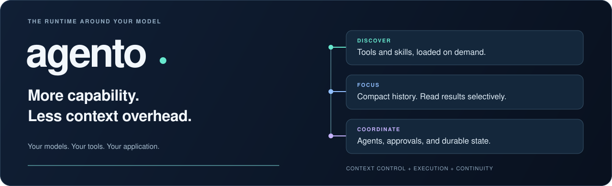
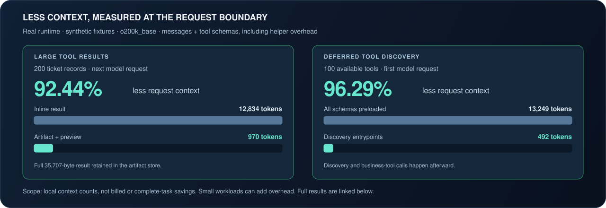
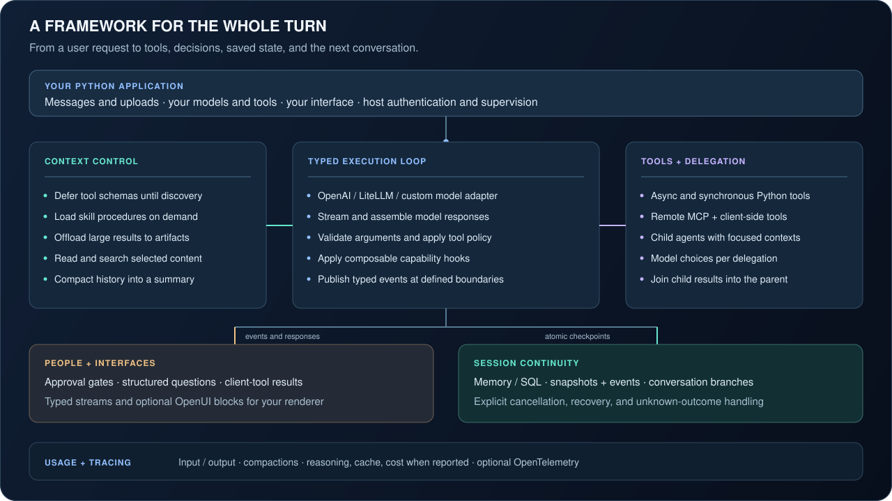

<div align="center">



**Context management. Durable execution. Tools, people, and agents working together.**

Python 3.10+ &nbsp; · &nbsp; Async &nbsp; · &nbsp; Typed &nbsp; · &nbsp; Pydantic-only core &nbsp; · &nbsp; MIT

[](https://github.com/GtechGovind/agento/actions/workflows/ci.yml)
[](https://github.com/GtechGovind/agento/actions/workflows/security.yml)

[Quickstart](#run-your-first-tool-in-a-minute) &nbsp; · &nbsp; [Token efficiency](docs/token-efficiency.md) &nbsp; · &nbsp; [Documentation](docs/README.md) &nbsp; · &nbsp; [Examples](examples) &nbsp; · &nbsp; [Contribute](CONTRIBUTING.md)

</div>

---

## More tools and knowledge. A carefully managed context.

Every tool schema, procedure, result, and past exchange takes space in a model's
input. As an agent does more work, that context can become its bottleneck.

**agento treats context as a resource to manage.** Discover tool schemas when
needed. Load skills on demand. Store large results and read the relevant parts.
Compact long histories. Delegate focused work to child agents. These capabilities
run inside a typed execution loop with approvals, persistence, and observable events.

Embed it in your Python application and bring your own models, tools, and interface.

## Token efficiency you can inspect



These measurements count **serialized request messages and tool schemas** from
paired executions of the real runtime with synthetic fixtures and scripted model
responses. They include helper schemas and instructions. The 200-record result
was retained byte-for-byte in the artifact store.

The scope is the next request after offloading, or the initial request before
tool discovery. **These are not provider-billed or complete-task savings.**
Small workloads can use more context: the 20-record case added 337 tokens, and
deferring one tool added 212. Retrieval, discovery, and summarization have costs.
[Inspect all six cases, tradeoffs, and reproduction commands →](docs/token-efficiency.md)

## The framework around the model



| Layer | What you can build with it |
| --- | --- |
| **Context** | Deferred schemas, on-demand skills, history compaction, artifact offloading, and selective reads/searches |
| **Tools and policy** | Typed Python functions, validated arguments, MCP connectors, client-side tools, selectors, and approval gates |
| **Multiple agents** | Focused child contexts, delegation, joined results, and configurable model choices per delegation |
| **Durability** | Memory or SQL storage, atomic snapshots and events, conversation branches, cancellation, and explicit recovery |
| **Application interfaces** | Streaming events, structured questions, approval responses, optional OpenUI blocks, and provider-dependent structured/multimodal output |
| **Visibility** | Turn/thread usage, compaction counts, optional OpenTelemetry tracing, and reasoning/cache/cost fields when providers report them |
| **Extensions** | Capability hooks and replaceable model, tool, storage, artifact, and skill contracts |

All of this sits around a **Pydantic-only core**. Install provider, database, MCP,
and tracing adapters as needed. Explore the [architecture](docs/architecture.md)
and [capability system](docs/capabilities.md).

## Run your first tool in a minute

From a checkout of this repository, install the core:

```bash
git clone https://github.com/GtechGovind/agento.git
cd agento
python -m pip install -e .
```

Save this as `hello.py` and run `python hello.py`. No API key needed.

```python
import asyncio
import agento

@agento.tool(read_only=True)
async def shipment_status(order_id: str) -> str:
    """Look up a shipment by order ID."""
    return {"ORD-7": "out for delivery"}.get(order_id, "unknown order")

async def main():
    app = agento.Agento(llm=agento.ScriptedLLM([
        agento.say(tool_calls=[("shipment_status", {"order_id": "ORD-7"})]),
        agento.say("Your order is out for delivery."),
    ]))
    agent = agento.Agent(name="shipping", model="scripted/demo", tools=[shipment_status])
    session = await app.sessions.create(agent=agent)
    print(await session.run("Where is ORD-7?"))

asyncio.run(main())
```

```text
Your order is out for delivery.
```

The Python tool really runs. `ScriptedLLM` supplies fixed model responses so you
can explore the runtime and write repeatable tests without an account.

### Bring a real model

Install `python -m pip install -e '.[openai]'`, set `OPENAI_API_KEY` and
`AGENTO_MODEL` to a model available to your account, and replace the `app` and
`agent` definitions inside `main()` with:

```python
import os

app = agento.Agento(llm=agento.OpenAIProvider())
agent = agento.Agent(name="shipping", model=os.environ["AGENTO_MODEL"], tools=[shipment_status])
```

Use the direct OpenAI adapter, an OpenAI-compatible endpoint, or provider routing
through LiteLLM. Install adapters as needed; **the core depends only on Pydantic**.
The LiteLLM extra requires Python 3.11+.

Follow [getting started](docs/getting-started.md) to add streaming, approvals, and SQLite.

## Know what happened. Decide what happens next.

Complete model messages and tool results are checkpointed before they reach the
stream consumer. Snapshots and their events commit together. Token deltas remain
transient, and active turns require explicit cancellation.

When an action is interrupted without a durable result, its outcome is **unknown**.
agento makes that uncertainty explicit so your application can reconcile before
retrying. Your application owns authentication, permissions, task supervision,
and business idempotency. See [recovery and deployment](docs/operations.md).

## Find your next step

| You want to… | Start here |
| --- | --- |
| **Build an assistant** | [Getting started](docs/getting-started.md) · [Tools and approvals](docs/tools.md) |
| **Keep conversations across restarts** | [Persistence, branches, and recovery](docs/persistence.md) |
| **Connect your interface** | [Events](docs/events.md) · [Public API](docs/api.md) |
| **Manage context or delegate work** | [Capabilities](docs/capabilities.md) · [Architecture](docs/architecture.md) |
| **Measure context and token overhead** | [Mechanisms, measurements, and tradeoffs](docs/token-efficiency.md) |
| **Learn by running code** | [Six complete examples](examples) — from hello to a custom capability |
| **Prepare a deployment** | [Operations](docs/operations.md) · [Validation and release status](docs/validation.md) |
| **Download or verify a release** | [GitHub releases](https://github.com/GtechGovind/agento/releases) · [Checksums, provenance, and release process](docs/releases.md) |

## Built to be inspected

The [local validation record](docs/validation.md) documents **179 passing tests**
and **88.18% combined statement and branch coverage**. CI covers Python 3.10–3.14
and PostgreSQL durability. Strict typing, lint, runnable examples, and package
checks are part of the [contribution workflow](CONTRIBUTING.md).

**Status: pre-release.** Live-provider and deployment acceptance remain release
work; the validation guide records what has and has not been verified.

---

**Help shape agento.** Bring a reproducible bug, a useful integration, or a clearer
example. Start with [contributing](CONTRIBUTING.md), the [security policy](SECURITY.md),
and the [changelog](CHANGELOG.md).

Licensed under [MIT](LICENSE). See [NOTICE](NOTICE) for third-party license information.
