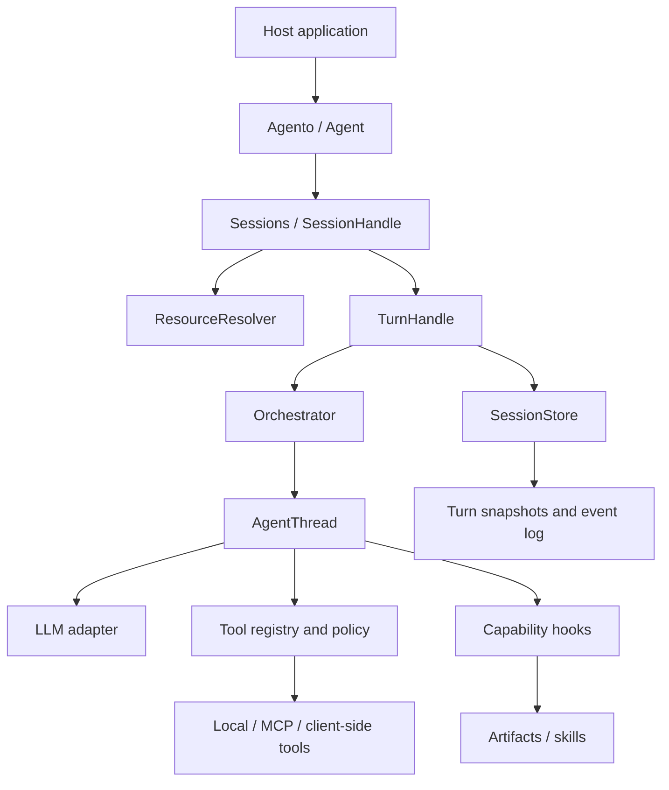

# Architecture

agento is a Python library embedded in a host application. Its central unit is a
**turn**: a resumable execution whose thread context and durable events live in a
session store. Models, tools, and storage sit behind replaceable contracts.

## Responsibilities and source entry points

| Component | Owns | Source |
| --- | --- | --- |
| `Agento` | Host resources, provider resolution, agent registry | [agento.py](../src/agento/session/agento.py) |
| `Sessions` | Creation, external IDs, live-agent rebinding | [sessions.py](../src/agento/session/sessions.py) |
| `SessionHandle` | Parent resolution, input preparation, expected-tip check | [session_handle.py](../src/agento/session/session_handle.py) |
| `ResourceResolver` | Building thread dependencies and closing MCP connections | [resolver.py](../src/agento/session/resolver.py) |
| `TurnHandle` | Persisting transitions, streaming public events, finalization | [turn_handle.py](../src/agento/session/turn_handle.py) |
| `Orchestrator` | Active threads, child creation, joins, aggregate outcome | [orchestrator.py](../src/agento/core/runtime/orchestrator.py) |
| `AgentThread` | Context-derived state, model/tool steps, capability hooks | [agent_thread.py](../src/agento/core/runtime/agent_thread.py) |
| Tool registry / policy | Names, schemas, eligibility, approval rules | [registry.py](../src/agento/core/tools/registry.py), [policy.py](../src/agento/core/tools/policy.py) |
| Stores | Atomic writes, terminal immutability, event queries | [store protocol](../src/agento/session/store/base.py) |

## One turn, end to end

1. `SessionHandle` reloads the current session tip and resolves its parent. A
   running parent is a conflict, not an implicit cancellation.
2. `ResourceResolver` rebuilds thread definitions from the supplied live agent
   and prior snapshots. Input is validated and translated into context.
3. The store inserts the turn and advances the session tip atomically, checking
   the tip observed during preparation.
4. Iterating `TurnHandle.stream()` starts execution. `Orchestrator` selects
   active threads; each `AgentThread` derives its next action from context.
5. The thread requests a model response or executes eligible tools. Capability
   hooks can append/replace context, persist capability state, or emit events.
6. Internal context transitions carry their durable public events.
   `TurnHandle` commits the new snapshot and those events together before
   publishing them. It avoids inserting an event again when its public form
   subsequently passes through the runtime.
7. Normal finish, cancellation, and handled errors converge on terminal state
   persistence and resource cleanup. A dead process or unavailable database
   needs host-supervised recovery.

## Thread state and relationships

An unanswered assistant tool call keeps a thread open. Approval records determine
whether it may execute; client-side calls wait for the host. A child thread has a
parent thread ID and the tool-call ID it must answer. Finishing that child appends
its result to the parent's context. The child is removed before its `ThreadDone`
checkpoint, so reload does not resurrect a retired child.

Child completion is included in the snapshot before the completed message is
published. Recovery can deliver that completion without repeating the model
call. Calls interrupted without a durable result carry an unknown outcome;
[reconciliation](operations.md) belongs to the host/tool service.

Turns form a tree through `previous_turn_id`; session history follows the active
tip's ancestors. Branches keep their original records. Python tool functions
remain outside serialized agent configuration and must be rebound after restart.

## Extension boundaries

Keep provider-specific wire conversion inside model adapters and common message
serialization. Keep approval decisions in tool policy, not provider code. Put
context strategies in capabilities; persistence belongs to `TurnHandle` and the
store rather than inside individual tools.

The core does not depend on the session facade. Optional packages are imported
when their adapters are constructed/used. The relationship tests check public
exports and this dependency direction; behavioral tests check the actual call
and persistence boundaries. An AST graph is a navigation aid, not proof that a
runtime interaction is correct.

Graphify is installed as shared tooling outside the repository. A local
`graphify-out/` graph can be refreshed after changes and queried for source
relationships. Generated audit data is excluded from releases.

## Provenance

The original design drew on [TrueForge](https://github.com/truefoundry/trueforge).
[NOTICE](../NOTICE) preserves that attribution. The historical [design plan](PLAN.md)
records the initial goals; it is not a claim of complete feature parity.
